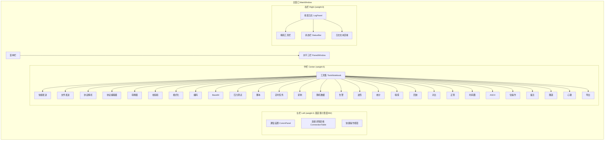

# 通信调试工具 - 页面布局分析与改进建议

## 一、当前布局概览

### 1.1 主窗口结构（`main_window.py`）

```
┌──────────────────────────────────────────────────────────────┐
│  菜单栏: 文件 | 工具 | 帮助                                  │
├──────────────────────────────┬───────────────────────────────┤
│  ┌─ 通信设置 ─────────────┐  │  ┌─ 收发日志 ──────────────┐  │
│  │ 协议选择 | IP | 端口    │  │  │ 显示模式 | 自动滚动      │  │
│  │ 串口参数 (条件显示)     │  │  │ 过滤 | 搜索              │  │
│  │ ▶连接 | ■全部断开      │  │  │                          │  │
│  │ ┌─ 连接详情 ─────────┐ │  │  │  [日志文本区域]          │  │
│  │ │ 表格: 发送/接收/协议 │ │  │  │                          │  │
│  │ │      地址/状态/TX/RX│ │  │  │                          │  │
│  │ └─────────────────────┘ │  │  │                          │  │
│  │ 快捷操作按钮行          │  │  │                          │  │
│  ├─────────────────────────┤  │  │                          │  │
│  │  ┌─ 工具集 (Notebook) ─┐│  │  │                          │  │
│  │  │ 发送 | 数据处理 |    ││  │  │                          │  │
│  │  │ 测试 | 监控 | 辅助   ││  │  │                          │  │
│  │  │ 网络                ││  │  │                          │  │
│  │  └─────────────────────┘│  │  │                          │  │
│  └─────────────────────────┘  │  └───────────────────────────┤
├──────────────────────────────┴───────────────────────────────┤
│  状态栏: ●未连接 | TX:0 | RX:0 | 协议:- | 地址:- | 就绪     │
└──────────────────────────────────────────────────────────────┘
```

- **布局方式**: 左右分栏（`PanedWindow`），左侧权重5，右侧权重3
- **窗口尺寸**: 默认 1400×800，最小 1200×650
- **左侧内容**: 通信设置面板 + 工具集 Notebook（二级标签页）
- **右侧内容**: 收发日志面板

### 1.2 MQTT 独立窗口结构（`mqtt_window.py`）

```
┌──────────────────────────────────────────────────────────────┐
│  ┌─ MQTT控制面板 ────────┐  │  ┌─ 消息列表 ──────────────┐  │
│  │ (由 MqttPanel 实现)    │  │  │ 主题过滤 | 内容过滤      │  │
│  │                        │  │  │ 导出CSV/TXT/JSON | 清除  │  │
│  │                        │  │  │                          │  │
│  │                        │  │  │  [消息表格]              │  │
│  │                        │  │  │  时间|主题|QoS|Hex|文本  │  │
│  │                        │  │  │                          │  │
│  └────────────────────────┘  │  └──────────────────────────┤
├──────────────────────────────┴───────────────────────────────┤
│  左右分割比例: 50%/50%                                        │
└──────────────────────────────────────────────────────────────┘
```

---

## 二、可用性分析

### 2.1 优点

| 特性 | 说明 |
|------|------|
| **多协议同时连接** | 支持 TCP/UDP/串口/WebSocket 同时在线，互不干扰 |
| **连接详情表格** | 集中展示所有连接的状态、收发计数，一目了然 |
| **发送/接收独立开关** | 每行可独立控制发送/接收，灵活度高 |
| **日志功能丰富** | 支持 Hex/ASCII/混合显示、搜索、过滤、自动保存、浮动窗口 |
| **工具集分组合理** | 6 大分组（发送/数据处理/测试/监控/辅助工具/网络），逻辑清晰 |
| **配置持久化** | 保存窗口尺寸、分割比例、面板状态 |

### 2.2 问题与不足

#### 问题 1：左侧内容过载，垂直滚动频繁
- 通信设置面板 + 连接详情表格 + 快捷操作按钮 + 工具集 Notebook 全部堆叠在左侧
- 在 800px 高度下，用户需要频繁滚动才能访问底部工具
- 工具集标签页切换后，内容区域高度被进一步压缩

#### 问题 2：工具集标签页层级过深
- 一级标签（6个）→ 二级标签（每个分组内多个子面板）
- 用户需要先点一级标签，再点二级标签，操作路径长
- 标签文字带空格（如 ` 发送 `），视觉上不紧凑

#### 问题 3：通信设置面板布局拥挤
- 协议选择、IP/端口、串口参数、连接按钮全部挤在第一行
- 协议切换时串口参数区域动态显示/隐藏，导致布局跳动
- "刷新IP"按钮尺寸过小（width=6），点击区域小

#### 问题 4：连接详情表格信息密度高
- 7 列信息（发送/接收/协议/地址/状态/TX/RX）挤在有限宽度内
- 发送/接收开关使用 ☑/☐ 符号，可点击性不强
- 表格高度固定为 5 行，连接多时需要滚动

#### 问题 5：日志面板功能按钮过多
- 工具栏有 7 个控件（显示模式3个RadioButton + 自动滚动 + 浮动 + 自动保存 + 清空）
- 搜索栏有 8 个控件（过滤下拉框 + 搜索输入框 + 上下按钮 + 计数 + 清除）
- 功能丰富但视觉杂乱，用户认知负担重

#### 问题 6：MQTT 窗口左右分割缺乏主次
- 左右各占 50%，但左侧控制面板通常比右侧消息列表更重要
- 消息列表的过滤栏和导出按钮占用较多垂直空间

---

## 三、视觉层级分析

### 3.1 当前层级结构

```
第一层级: 菜单栏 (最顶部)
第二层级: 通信设置 (左侧顶部) | 日志面板 (右侧)
第三层级: 连接详情表格
第四层级: 工具集 Notebook
第五层级: 状态栏 (最底部)
```

### 3.2 问题

1. **通信设置与工具集之间缺乏视觉分隔**：两者直接上下堆叠，没有明显的分组边界
2. **连接详情表格的标题不够突出**：`LabelFrame` 的标题文字与普通标签差异不大
3. **状态栏信息过多**：连接状态、TX/RX 计数、协议、地址、消息、状态信息共 6 个元素挤在一行
4. **工具集标签页的活跃状态不够明显**：默认 ttk 主题下，选中标签与未选中标签的视觉差异小

---

## 四、响应式表现分析

### 4.1 当前表现

| 场景 | 表现 |
|------|------|
| 窗口宽度 1400+ | 左右比例 62:38，布局舒适 |
| 窗口宽度 1200（最小值） | 左侧工具集标签文字可能截断 |
| 窗口高度 800+ | 内容基本可见 |
| 窗口高度 650（最小值） | 左侧需要频繁滚动 |
| macOS 缩放/高DPI | 使用 ttk 主题，基本适配 |

### 4.2 问题

1. **最小宽度 1200 过高**：在 1366×768 笔记本屏幕上几乎占满
2. **高度适应性差**：低于 800px 时左侧内容严重溢出
3. **PanedWindow 分割比例固定**：用户可拖动但无记忆功能（已实现保存）
4. **字体大小硬编码**：部分面板使用 `font=('', 10)` 等固定值，不跟随系统缩放

---

## 五、字体排版分析

### 5.1 当前字体使用

| 位置 | 字体 | 大小 |
|------|------|------|
| 工具集一级标签 | 默认 | 12 |
| 工具集二级标签 | 默认 | 11 |
| Hex 输入框 | Courier New | 10 |
| 日志文本 | monospace | 默认 |
| 普通标签 | 默认 | 默认 |

### 5.2 问题

1. **字体大小缺乏层次**：标题、子标题、正文、辅助信息的字体大小差异不明显
2. **等宽字体使用不一致**：部分 Hex 输入框使用 Courier New，部分使用默认字体
3. **标签内边距不一致**：部分标签使用 `padding=8`，部分使用 `padding=6`，视觉不统一

---

## 六、交互元素位置优化建议

### 6.1 网格结构改进

#### 建议 1：改为三栏布局（主窗口）

```
┌──────────────────────────────────────────────────────────────┐
│  菜单栏                                                      │
├──────────────┬───────────────────────┬───────────────────────┤
│  通信设置    │  工具集 (Notebook)     │  收发日志             │
│  (固定宽度)  │  (弹性宽度)            │  (弹性宽度)           │
│              │                       │                       │
│  协议选择    │  发送 | 数据处理 | 测试 │  [日志文本区域]       │
│  参数配置    │  监控 | 辅助 | 网络    │                       │
│  连接按钮    │                       │                       │
│  连接详情    │  [子面板内容]          │                       │
│              │                       │                       │
├──────────────┴───────────────────────┴───────────────────────┤
│  状态栏                                                      │
└──────────────────────────────────────────────────────────────┘
```

**理由**：
- 通信设置是高频操作区域，应固定宽度不随窗口变化
- 工具集和日志面板都需要较大空间，各自独立
- 三栏布局减少垂直堆叠，降低滚动需求

#### 建议 2：工具集标签扁平化

将二级标签提升为一级标签，减少点击层级：

```
当前: 发送 → 快捷发送 | 文件发送 | 协议解析 | 协议编辑器
改进: 快捷发送 | 文件发送 | 协议解析 | 协议编辑器 | 转换器 | 校验和 | ...
```

**理由**：
- 减少用户操作路径
- 所有工具一目了然
- 适合使用可滚动的标签栏

### 6.2 间距优化

| 位置 | 当前值 | 建议值 | 理由 |
|------|--------|--------|------|
| 主容器 `padx` | 6 | 8 | 增加呼吸空间 |
| 主容器 `pady` | (6, 0) | 8 | 上下对称 |
| 面板内 `padding` | 6/8 混用 | 统一 8 | 一致性 |
| 控件间 `padx` | 2/4/8 混用 | 统一 4/8 | 简化间距系统 |
| 状态栏 `pady` | (2, 6) | (4, 8) | 增加底部留白 |

### 6.3 字体排版改进

| 层级 | 建议字体大小 | 用途 |
|------|-------------|------|
| H1 | 13-14 | 面板标题（LabelFrame text） |
| H2 | 11-12 | 子面板标题、标签页 |
| Body | 10 | 普通标签、输入框 |
| Mono | 10 | Hex 数据、日志内容 |
| Small | 8-9 | 辅助信息、计数、状态 |

### 6.4 交互元素位置优化

#### 通信设置面板
1. **协议选择区**：将协议选择、IP/端口、串口参数分为两行，避免单行过长
2. **连接按钮**：放大 "▶ 连接" 按钮（width=12），增加视觉权重
3. **连接详情表格**：增加高度自适应（根据连接数量动态调整），或设置最小高度 3 行、最大 8 行

#### 日志面板
1. **工具栏精简**：将"浮动"和"自动保存"合并到右键菜单或齿轮菜单中
2. **搜索栏整合**：将过滤下拉框和搜索框放在同一行，减少垂直占用
3. **显示模式**：使用下拉框替代 3 个 RadioButton，节省水平空间

#### 状态栏
1. **信息分组**：左侧放连接状态 + 协议，中间放 TX/RX，右侧放消息
2. **增加分隔**：使用更明显的分隔符区分不同信息组

#### MQTT 窗口
1. **分割比例调整**：左侧 40% / 右侧 60%，给消息列表更多空间
2. **过滤栏折叠**：默认只显示主题过滤，内容过滤可展开

---

## 七、优先级排序与实施建议

### P0 - 高优先级（影响核心体验）

| 序号 | 改进项 | 涉及文件 | 工作量 |
|------|--------|----------|--------|
| 1 | 左侧内容垂直溢出优化（最小高度适应性） | `main_window.py` | 小 |
| 2 | 通信设置面板布局重组（两行布局） | `comm_panel.py` | 中 |
| 3 | 连接详情表格高度自适应 | `comm_panel.py` | 小 |
| 4 | 统一面板内边距为 8px | 多个文件 | 中 |

### P1 - 中优先级（提升使用效率）

| 序号 | 改进项 | 涉及文件 | 工作量 |
|------|--------|----------|--------|
| 5 | 工具集标签扁平化（减少层级） | `tools_notebook.py` | 大 |
| 6 | 日志面板工具栏精简 | `log_panel.py` | 中 |
| 7 | 状态栏信息分组优化 | `main_window.py` | 小 |
| 8 | MQTT 窗口分割比例调整 | `mqtt_window.py` | 小 |

### P2 - 低优先级（视觉打磨）

| 序号 | 改进项 | 涉及文件 | 工作量 |
|------|--------|----------|--------|
| 9 | 字体大小层次规范化 | 多个文件 | 中 |
| 10 | 标签页活跃状态视觉增强 | `tools_notebook.py` | 小 |
| 11 | 最小窗口宽度降低至 1000 | `main_window.py` | 小 |
| 12 | 日志面板显示模式改为下拉框 | `log_panel.py` | 小 |

---

## 八、Mermaid 图表：改进后的布局结构



---

## 九、总结

当前项目的布局在功能完整性上表现出色，支持多协议同时连接、丰富的工具集和完善的日志功能。主要改进方向集中在：

1. **减少垂直堆叠**：通过三栏布局或优化面板高度，降低滚动需求
2. **简化交互路径**：扁平化工具集标签层级，减少用户操作步骤
3. **统一视觉规范**：建立一致的间距、字体、颜色系统
4. **优化信息密度**：精简工具栏，合理分组状态信息
5. **提升响应能力**：降低最小窗口尺寸要求，增强高度适应性

建议按 P0 → P1 → P2 的优先级逐步实施，每次改动后进行全面测试，确保多协议同时连接等核心功能不受影响。